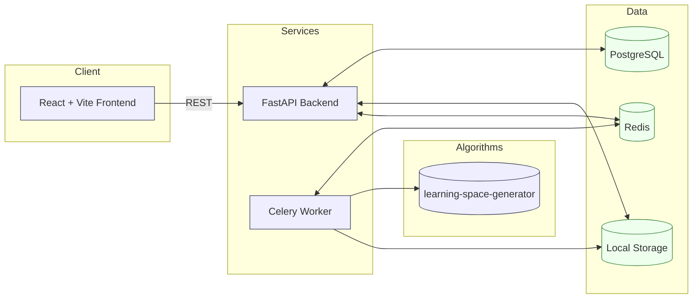

# Project Status Update · 17 Dec 2025 (EN)

## Executive Summary
The system enables uploading binary assessment matrices (CSV), configuring and running Learning Space construction via NEAT or IITA, tracking progress, and retrieving results (JSON/PNG). It is containerized with PostgreSQL, Redis, FastAPI backend, Celery worker, and React frontend. Current functionality supports end-to-end runs with progress updates and artifact storage.

---

## System Architecture



- Backend API: FastAPI app with versioned routes and CORS (see backend/app/main.py, backend/app/api/v1/router.py).
- Worker: Celery consumer that runs algorithms and parses stdout for real-time progress (backend/app/celery_app/tasks.py).
- Data: PostgreSQL ORM models for `Upload`, `Task`, `Result`; Redis as broker; local filesystem for uploaded data and result artifacts.
- Algorithms: `learning-space-generator` mounted read-only into containers and executed as a Python module (`lsg.run`).
- Deployment: `docker compose` orchestrates all services; volumes ensure persistence for DB and storage.

---

## Data Flow

1. Upload CSV via frontend → `POST /api/v1/uploads/upload`.
   - Server validates type and size (≤ 100MB), auto-detects delimiter, extracts row/column counts, persists file in local storage.
   - DB record created in `uploads` with metadata.
2. Create Task → `POST /api/v1/tasks` with parameters.
   - Validates referenced `upload_id`; saves parameters (NEAT/IITA, thresholds, flags); triggers Celery job and stores `celery_task_id`.
3. Worker execution → `celery -A app.celery_app worker` runs `run_algorithm_task`.
   - Builds `python -m lsg.run` command with flags (e.g., `--use-iita`, `--generations`, `--json`, `--png`).
   - Streams stdout; regex-parses progress (generation, matrix completion iterations, RMSE, item counts) and updates `tasks.progress_percent` + `progress_details`. Also updates Celery state to `PROGRESS`.
   - Saves JSON result and optional PNG into storage; creates `results` DB record with algorithm-specific metadata.
4. Result consumption:
   - List: `GET /api/v1/results` with filters and pagination.
   - Detail: `GET /api/v1/results/{task_id}`.
   - Download: `GET /api/v1/results/{task_id}/download?format=json|png`.
   - Delete: `DELETE /api/v1/results/{task_id}` removes DB record and artifacts.

---

## API Overview

- Uploads
  - `POST /api/v1/uploads/upload`: Uploads CSV; returns metadata and storage key.
  - `GET /api/v1/uploads/uploads`: List recent uploads.
  - `GET /api/v1/uploads/uploads/{upload_id}`: Get upload details.
- Tasks
  - `POST /api/v1/tasks`: Create task; starts worker job; returns task info.
  - `GET /api/v1/tasks/{task_id}`: Get task status/progress.
  - `GET /api/v1/tasks`: List tasks.
- Results
  - `GET /api/v1/results`: List results with filters (algorithm, upload_id, date_from/to), returns summary items.
  - `GET /api/v1/results/{task_id}`: Get full result record.
  - `GET /api/v1/results/{task_id}/download`: Download JSON (default) or PNG when available.
  - `DELETE /api/v1/results/{task_id}`: Remove result and files.

---

## Frontend Highlights

- UploadForm: Client-side size guard, CSV upload with immediate validation feedback.
- TaskForm: Algorithm selection (NEAT vs IITA), NEAT params (generations, patience, parallel, greedy, plot), IITA `max_diff`, advanced flags (randomize items, matrix completion, clear cache, PNG export).
- ResultsPanel: Paginated listing with status chips, open graph, JSON/PNG download, deletion with confirmation modal.
- Tech stack: React 19, Vite 7, TypeScript 5.9, axios; React Flow likely used for graph visualization.

---

## Demo Plan (Local)

Prerequisite: Docker Desktop installed.

Commands:

```bash
# From repo root
docker compose up --build
```

Access:
- Frontend: http://localhost
- Backend: http://localhost:8000 (health: /health)

Suggested flow:
1. Upload sample CSV (binary matrix).
2. Configure NEAT for small matrices (<100 items) or IITA for large ones.
3. Launch task and monitor Results list; open JSON/PNG.

---

## Current Status & Evidence

- Endpoints implemented and wired; DB tables created at app start.
- Celery parsing covers NEAT generation updates, IITA item processing, and matrix completion iterations.
- Storage service supports uploads, results, direct file path access, and deletion.
- Frontend flows for upload → configure → run → list/download are in place.

---

## Risks & Next Steps

- CSV robustness: add schema validation (binary values, consistent row lengths), better delimiter inference reporting.
- Algorithm defaults: empirical tuning of NEAT hyperparameters and IITA thresholds for typical datasets.
- Visualization scaling: layout strategies and performance for large graphs.
- Observability: structured logs, error taxonomies, retry/backoff for worker.
- Config portability: optional S3 storage, environment profiles (dev/prod), secrets management.

---

## Appendix

- Compose services: `postgres`, `redis`, `backend` (uvicorn), `celery`, `frontend` (nginx).
- Key files for review:
  - Backend app entry: backend/app/main.py
  - API router: backend/app/api/v1/router.py
  - Endpoints: uploads.py, tasks.py, results.py
  - Worker task: backend/app/celery_app/tasks.py
  - Models: backend/app/models/{upload,task,result}.py
  - Storage: backend/app/services/storage.py
  - Frontend components: frontend/src/components/{UploadForm,TaskForm,ResultsPanel}.tsx

  ---

  ## Why IITA (not NEAT) for this dataset

  IITA was chosen for the analyses referenced in this document because the datasets we used are relatively large and sparse, and the task is primarily to infer direct prerequisite relations between items. IITA (Inductive Item Tree Analysis) is designed to extract logical/conditional relations from binary response matrices and is well suited to identify pairwise prerequisite links at scale. Key reasons for preferring IITA here:

  - Scalability: IITA works efficiently on larger item sets and focuses on pairwise statistical criteria, which scales better than running a full structural search with evolutionary methods.
  - Interpretability: The output of IITA is a set of explicit relations (A → B) that are straightforward to interpret and validate with domain experts.
  - Determinism and repeatability: IITA produces stable relations given the same data and threshold, while NEAT is stochastic (evolutionary) and can produce varied structures across runs unless extensively tuned.
  - Suitability for dense relation discovery: For exploratory analysis where discovering many candidate prerequisites is valuable, IITA with a tunable `diff` threshold lets us control precision/recall trade-offs directly.

  NEAT is retained in the system because it excels in a complementary scenario: when the goal is to search for compact learning-space structures, optimize global graph properties, or construct richer state-based models for smaller item sets where evolutionary search is tractable. In practice we recommend:

  - Use IITA by default for large datasets and when explicit prerequisite discovery is needed.
  - Use NEAT for smaller, curated item sets when you want to search for global structures or optimize across multiple objectives (compactness, validity, discrepancy).

  Tuning the `iita_max_diff` threshold is important: lower values produce denser graphs (higher recall), higher values produce sparser, higher-precision relations. We include grid-search experiments in `learning-space-generator/output/` for choosing a sensible default (0.08 used in current runs).
