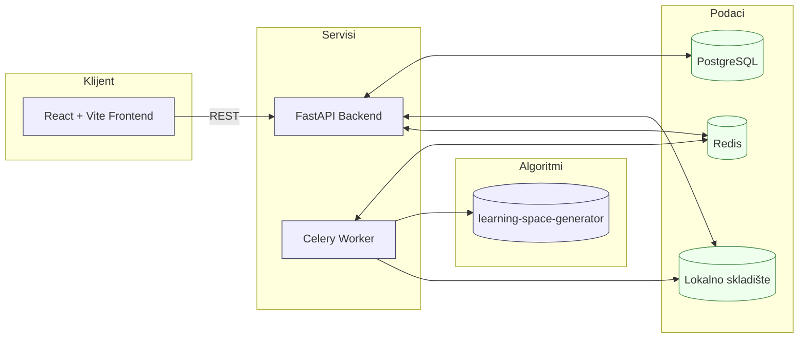

# Izveštaj o statusu projekta · 17.12.2025 (SR)

Pripremljeno za: prof. Goran Savić · SOTIS Predavanja
Sesija: Predavanje online preko Microsoft Teams; vežbe uživo u 12:15

---

## Sažetak
Sistem omogućava upload binarnih matrica procene (CSV), konfiguraciju i pokretanje konstrukcije Learning Space-a preko NEAT ili IITA pristupa, praćenje napretka u realnom vremenu i preuzimanje rezultata (JSON/PNG). Kontejnerizovano okruženje uključuje PostgreSQL, Redis, FastAPI backend, Celery radnik i React frontend. Trenutno je omogućeno end-to-end izvršavanje sa čuvanjem artefakata i prikazom rezultata.

---

## Arhitektura sistema



- Backend API: FastAPI aplikacija sa verzionisanim rutama i CORS podešavanjima (backend/app/main.py, backend/app/api/v1/router.py).
- Radnik: Celery potrošač koji pokreće algoritme i parsira stdout za praćenje napretka (backend/app/celery_app/tasks.py).
- Podaci: PostgreSQL ORM modeli za `Upload`, `Task`, `Result`; Redis kao broker; lokalni fajl sistem za upload i rezultat artefakte.
- Algoritmi: `learning-space-generator` je montiran read-only u kontejnere i pokreće se kao Python modul (`lsg.run`).
- Deploy: `docker compose` orkestrira sve servise; volumeni obezbeđuju perzistenciju baze i skladišta.

---

## Tok podataka

1. Upload CSV preko frontenda → `POST /api/v1/uploads/upload`.
   - Server proverava tip i veličinu (≤ 100MB), automatski detektuje delimiter, ekstrahuje broj redova/kolona i čuva fajl u lokalnom skladištu.
   - DB zapis se kreira u `uploads` sa metapodacima.
2. Kreiranje Task-a → `POST /api/v1/tasks` sa parametrima.
   - Validira `upload_id`; čuva parametre (NEAT/IITA, pragovi, flagovi); pokreće Celery posao i čuva `celery_task_id`.
3. Izvršenje radnika → `celery -A app.celery_app worker` pokreće `run_algorithm_task`.
   - Formira komandu `python -m lsg.run` sa opcijama (npr. `--use-iita`, `--generations`, `--json`, `--png`).
   - Streamuje stdout; regex-parsira napredak (generacije, iteracije dopune matrice, RMSE, broj stavki) i ažurira `tasks.progress_percent` + `progress_details`. Ažurira i Celery stanje u `PROGRESS`.
   - Snima JSON rezultat i opciono PNG u skladište; kreira `results` zapis sa metapodacima specifičnim za algoritam.
4. Potrošnja rezultata:
   - Lista: `GET /api/v1/results` sa filtrima i paginacijom.
   - Detalj: `GET /api/v1/results/{task_id}`.
   - Preuzimanje: `GET /api/v1/results/{task_id}/download?format=json|png`.
   - Brisanje: `DELETE /api/v1/results/{task_id}` uklanja DB zapis i fajlove.

---

## Pregled API-ja

- Uploads
  - `POST /api/v1/uploads/upload`: Upload CSV; vraća metapodatke i storage key.
  - `GET /api/v1/uploads/uploads`: Lista skorije upload-ovane fajlove.
  - `GET /api/v1/uploads/uploads/{upload_id}`: Detalji upload-a.
- Tasks
  - `POST /api/v1/tasks`: Kreira task; pokreće radnika; vraća informacije o tasku.
  - `GET /api/v1/tasks/{task_id}`: Status/progres taska.
  - `GET /api/v1/tasks`: Lista taskova.
- Results
  - `GET /api/v1/results`: Lista rezultata sa filtrima (algorithm, upload_id, date_from/to); vraća sažetke.
  - `GET /api/v1/results/{task_id}`: Detaljan rezultat.
  - `GET /api/v1/results/{task_id}/download`: Preuzimanje JSON (podrazumevano) ili PNG ako postoji.
  - `DELETE /api/v1/results/{task_id}`: Brisanje rezultata i fajlova.

---

## Frontend naglasci

- UploadForm: klijentska provera veličine, upload CSV uz trenutni feedback o validaciji.
- TaskForm: izbor algoritma (NEAT vs IITA), NEAT parametri (generations, patience, parallel, greedy, plot), IITA `max_diff`, napredne opcije (randomize items, matrix completion, clear cache, PNG export).
- ResultsPanel: paginirana lista sa status bedževima, otvaranje grafa, JSON/PNG preuzimanje, brisanje uz potvrdu.
- Stog tehnologija: React 19, Vite 7, TypeScript 5.9, axios; React Flow verovatno korišćen za vizualizaciju grafa.

---

## Plan demonstracije (lokalno)

Preduslov: Instaliran Docker Desktop.

Komande:

```bash
# Iz korena repozitorijuma
docker compose up --build
```

Pristup:
- Frontend: http://localhost
- Backend: http://localhost:8000 (health: /health)

Predlog toka:
1. Upload uzorka CSV (binarna matrica).
2. Konfiguriši NEAT za male matrice (<100 stavki) ili IITA za velike.
3. Pokreni task i posmatraj listu rezultata; otvori JSON/PNG.

---

## Trenutni status i evidencija

- Implementirane rute; DB tabele se kreiraju pri startu aplikacije.
- Celery parsiranje pokriva NEAT generacije, IITA obradu stavki i iteracije dopune matrice.
- Storage servis podržava upload, rezultate, direktan pristup fajlovima i brisanje.
- Frontend tok upload → konfiguracija → pokretanje → lista/preuzimanje je operativan.

---

## Rizici i sledeći koraci

- Robusnost CSV: dodati validaciju šeme (binarne vrednosti, konzistentne dužine redova), bolje izveštavanje o detekciji delimitera.
- Podrazumevane vrednosti algoritama: empirijsko podešavanje NEAT hiperparametara i IITA pragova za tipične skupove podataka.
- Skaliranje vizualizacije: strategije layout-a i performanse za velike grafove.
- Observabilnost: strukturisani logovi, klasifikacija grešaka, retry/backoff za radnika.
- Portabilnost konfiguracije: opciona S3 podrška, profili okruženja (dev/prod), rukovanje tajnama.

---

## Appendix

- Compose servisi: `postgres`, `redis`, `backend` (uvicorn), `celery`, `frontend` (nginx).
- Ključne datoteke:
  - Ulaz aplikacije: backend/app/main.py
  - API ruter: backend/app/api/v1/router.py
  - Endpoints: uploads.py, tasks.py, results.py
  - Radnički zadatak: backend/app/celery_app/tasks.py
  - Modeli: backend/app/models/{upload,task,result}.py
  - Skladište: backend/app/services/storage.py
  - Frontend komponente: frontend/src/components/{UploadForm,TaskForm,ResultsPanel}.tsx
