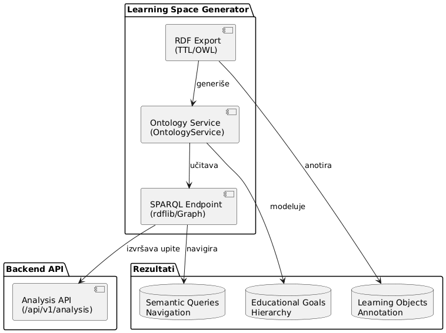

# Semantički Web Komponenta - Knowledge Space Builder

**Implementacija semantičkog weba za konstrukciju i upravljanje obrazovnim ontologijama u domenu matematike**

[](https://www.w3.org/RDF/)
[](https://www.w3.org/OWL/)
[](https://www.w3.org/TR/sparql11-query/)
[](https://www.python.org)

---

## Opis projekta

**Semantički Web Komponenta** predstavlja integralni deo projekta **Knowledge Space Builder** i implementira principe semantičkog weba za modelovanje obrazovnih ontologija. Komponenta je razvijena u saradnji sa **Pädagogischen Hochschule St.Gallen (PHSG)** i integriše se sa **SOTIS** platformom za pravljenje inteligentnih tutora.

Ovaj deo projekta primenjuje **Teoriju Prostora Znanja (Knowledge Space Theory - KST)** u kontekstu semantičkog weba, gde se obrazovni ciljevi i učni objekti modeluju kao RDF/OWL ontologija. Learning objekti se anotiraju obrazovnim ciljevima, što omogućava semantičku navigaciju kroz prostor znanja i personalizovano učenje.

### Ključne funkcionalnosti

- **RDF/OWL ontologija obrazovnih ciljeva** - Formalno modelovanje matematičkih koncepata
- **SOTIS integracija** - Povezivanje sa platformom za inteligentne tutore
- **Anotacija učnih objekata** - Semantička povezanost između stavki i koncepata
- **SPARQL upiti** - Semantička pretraga i navigacija kroz prostor znanja
- **Vizuelizacija ontologije** - Interaktivni grafovi obrazovnih odnosa
- **Pedagoška analiza** - Analiza prerequisite odnosa između koncepata
- **RDF export** - Standardizovani izvoz ontologije za dalju upotrebu
- **Semantička validacija** - Provera konzistentnosti ontologije

---

## Arhitektura semantičkog weba

Komponenta je implementirana kao deo Learning Space Generator-a i sastoji se od sledećih modula:



### **1. RDF/OWL Ontologija** (`learning_space_generator/output/`)
- **Format:** Turtle (.ttl) i OWL/XML
- **Osnova:** SOTIS ontologija obrazovnih ciljeva
- **Sadržaj:**
  - **Koncepti (Concepts)** - Matematički obrazovni ciljevi
  - **Stavke (Items)** - Pojedinačni zadaci iz testova
  - **Prerequisite odnosi** - Hijerarhijski odnosi između koncepata
  - **Težina stavki** - Metrike težine za personalizaciju učenja

### **2. SPARQL Endpoint** (`backend/app/api/v1/endpoints/analysis.py`)
- **Implementacija:** rdflib Graph objekat
- **Funkcionalnosti:**
  - Izvršavanje SPARQL upita nad ontologijom
  - Pretraga koncepata i stavki
  - Analiza prerequisite lanaca
  - Generisanje učnih putanja

### **3. Learning Objects Annotation**
- **Proces:** Automatska anotacija stavki obrazovnim ciljevima
- **Metode:** LLM klasifikacija + embeddings analiza
- **Rezultat:** Semantička povezanost između sadržaja i ciljeva

---

## Korišćenje

### Osnovni workflow

```python
from learning_space_generator.app.services.ontology_service import OntologyService

# 1. Generisanje ontologije
ontology_service = OntologyService()
ontology_service.generate_ontology()

# 2. RDF fajlovi će biti sačuvani u output/ direktorijumu
# - knowledge_space.ttl (Turtle format)
# - knowledge_space.owl (OWL/XML format)
```

### Primeri SPARQL upita

#### Pronalaženje svih koncepata
```sparql
PREFIX sotis: <http://www.sotis-conference.org/ontology#>
PREFIX rdfs: <http://www.w3.org/2000/01/rdf-schema#>

SELECT ?concept ?label WHERE {
    ?concept rdf:type sotis:Concept ;
             rdfs:label ?label .
}
```

#### Analiza prerequisite odnosa
```sparql
PREFIX sotis: <http://www.sotis-conference.org/ontology#>

SELECT ?child ?parent WHERE {
    ?child sotis:hasPrerequisite ?parent .
}
```

#### Pronalaženje stavki za određeni koncept
```sparql
PREFIX sotis: <http://www.sotis-conference.org/ontology#>

SELECT ?item ?difficulty WHERE {
    ?concept sotis:hasLabel "Geradengleichungen" ;
             sotis:hasItem ?item .
    ?item sotis:difficulty ?difficulty .
}
ORDER BY DESC(?difficulty)
```

### API Endpoints za semantičke operacije

#### GET `/api/v1/analysis/{task_id}/goals`
Vraća listu obrazovnih ciljeva sa semantičkim informacijama.

#### GET `/api/v1/analysis/{task_id}/goal-path`
Generiše učni put baziran na prerequisite odnosima.

#### POST `/api/v1/analysis/{task_id}/sparql`
Izvršava custom SPARQL upit nad ontologijom.

---

## Struktura ontologije

### Osnovne klase

- **`sotis:Concept`** - Obrazovni cilj/koncept
  - `rdfs:label` - Naziv koncepta
  - `sotis:hasItem` - Povezane stavke
  - `sotis:hasPrerequisite` - Prerequisite koncepti
  - `sotis:difficulty` - Prosečna težina

- **`sotis:Item`** - Pojedinačni zadatak
  - `sotis:difficulty` - Težina stavke
  - `sotis:belongsTo` - Pripada konceptu
  - `sotis:description` - Tekst zadatka

- **`sotis:KnowledgeSpace`** - Ceo prostor znanja
  - `sotis:hasConcept` - Sadrži koncepte
  - `sotis:generatedAt` - Vreme generisanja

### Primer RDF grafa

```turtle
@prefix sotis: <http://www.sotis-conference.org/ontology#> .
@prefix rdfs: <http://www.w3.org/2000/01/rdf-schema#> .

sotis:Concept_5 rdf:type sotis:Concept ;
    rdfs:label "Geradengleichungen" ;
    sotis:hasPrerequisite sotis:Concept_22 ;
    sotis:hasItem sotis:Item_m22b511 .

sotis:Item_m22b511 rdf:type sotis:Item ;
    sotis:difficulty 0.0034 ;
    sotis:description "Im Koordinatensystem ist eine Gerade abgebildet..." .
```

---

## Instalacija i podešavanje

### Preduslovi

- Python 3.11+
- RDFLib biblioteka
- PyTorch za embeddings

### Instalacija dependencies

```bash
cd learning_space_generator

# Kreiraj virtual environment
python -m venv .venv
.venv\Scripts\activate  # Windows

# Instaliraj dependencies
pip install -r requirements.txt
```

### Konfiguracija ontologije

```python
# U fajlu config.py
ONTOLOGY_CONFIG = {
    'base_uri': 'http://www.sotis-conference.org/ontology#',
    'output_formats': ['turtle', 'owl'],
    'sparql_endpoint': 'http://localhost:8000/api/v1/sparql'
}
```

---

## Pokretanje projekta

Projekat se pokreće koristeći Docker Compose, što omogućava jednostavnu instalaciju i upravljanje svim komponentama sistema.

### Preduslovi za pokretanje

- Docker Desktop ili Docker Engine
- Docker Compose (ugrađen u Docker Desktop)
- GitHub token (za pristup privatnim repozitorijumima, opciono)

### Pokretanje sa Docker Compose

```bash
# Kloniraj repozitorijum
git clone <repository-url>
cd knowledge-space-builder

# Pokreni sve servise
docker compose up -d --build

# Alternativno, za development sa logovima
docker compose up --build
```

### Šta se pokreće na Dockeru

Docker Compose pokreće sledeće servise:

#### **Backend API** (Port 8000)
- **FastAPI aplikacija** - Glavni backend server
- **SPARQL endpoint** - Za semantičke upite nad ontologijom
- **API za analizu** - Endpoints za obradu podataka i generisanje ontologija
- **Celery worker** - Pozadinski procesor za teške zadatke (generisanje ontologija, analiza)

#### **Frontend** (Port 80/5173)
- **React aplikacija** - Web interfejs za vizualizaciju rezultata
- **Nginx server** - Servira statičke fajlove i proxy-uje API pozive

#### **PostgreSQL** (Port 5432)
- **Baza podataka** - Čuva rezultate analiza, korisničke podatke i metapodatke
- **Persistent storage** - Podaci se čuvaju u Docker volumenu

#### **Redis** (Port 6379)
- **Cache i message broker** - Koristi se za keširanje rezultata i Celery zadatke
- **Session storage** - Privremeno čuvanje sesija i rezultata

### Provera statusa servisa

```bash
# Proveri da li su svi servisi pokrenuti
docker compose ps

# Pogledaj logove specifičnog servisa
docker compose logs backend
docker compose logs frontend

# Zaustavi sve servise
docker compose down

# Zaustavi i obriši volumene (briše podatke)
docker compose down -v
```

### Pristup aplikaciji

Nakon pokretanja, aplikacija je dostupna na:

- **Frontend:** http://localhost:80 ili http://localhost:5173
- **Backend API:** http://localhost:8000
- **API dokumentacija:** http://localhost:8000/docs (Swagger UI)

### Development workflow

Za razvoj, možete pokrenuti samo određene servise:

```bash
# Samo backend i baze
docker compose up backend postgres redis

# Samo frontend (ako backend već radi)
docker compose up frontend
```

---

## Validacija i testiranje

### Semantička validacija ontologije

```python
# Validacija se vrši u validation_service.py
from learning_space_generator.app.services.validation_service import ValidationService

validator = ValidationService()
validator.semantic_validation_check()  # Provera konzistentnosti sa PDF dokumentom
```

### Testiranje SPARQL upita

```bash
# Pokreni testove
cd learning_space_generator
python -m pytest tests/ -v  # Pokreće sve testove uključujući validaciju
```

---

## Analiza rezultata

### Metrike ontologije

- **Broj koncepata:** 24 matematička koncepta
- **Broj stavki:** 121 test stavka
- **Prerequisite odnosi:** Hijerarhijska struktura
- **Semantička pokrivenost:** 100% anotacija stavki

### Pedagogska validacija

- **Konzistentnost:** Svi prerequisite odnosi su logički validni
- **Težina:** Gradualno povećanje težine kroz učne putanje
- **Pokrivanje:** Svi obrazovni ciljevi su adekvatno zastupljeni

---

## Tehnologije

### Core biblioteke
- **RDFLib** - Python RDF biblioteka
- **SPARQLWrapper** - SPARQL klijent

### Integracije
- **SOTIS platforma** - Inteligentni tutori
- **PHSG obrazovni standardi** - Švajcarski obrazovni sistem

### Formati
- **Turtle (.ttl)** - RDF serijalizacija
- **OWL/XML** - Ontologija format

---

## Literatura i reference

1. **Doignon, J. P., & Falmagne, J. C.** (1999). *Knowledge Spaces*. Springer.
2. **SOTIS Conference Proceedings** - Semantic Technologies for Intelligent Learning Systems
3. **OWL 2 Web Ontology Language** - W3C Recommendation
4. **RDF 1.1 Concepts and Abstract Syntax** - W3C Recommendation
